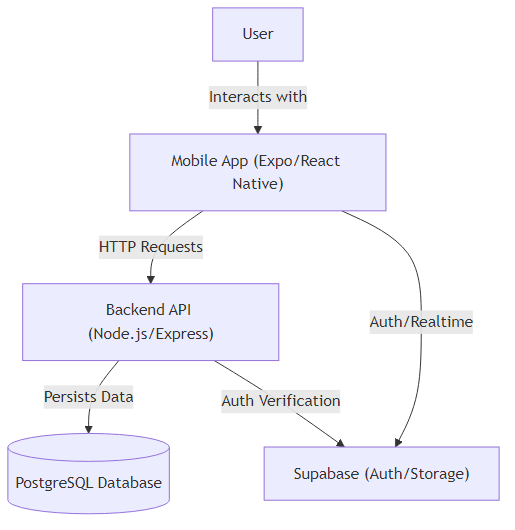
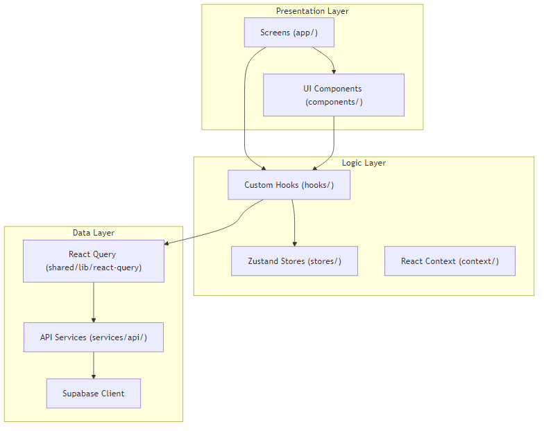
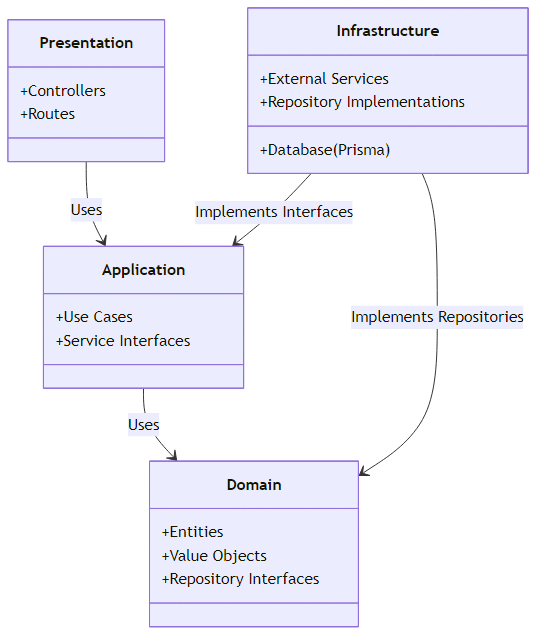
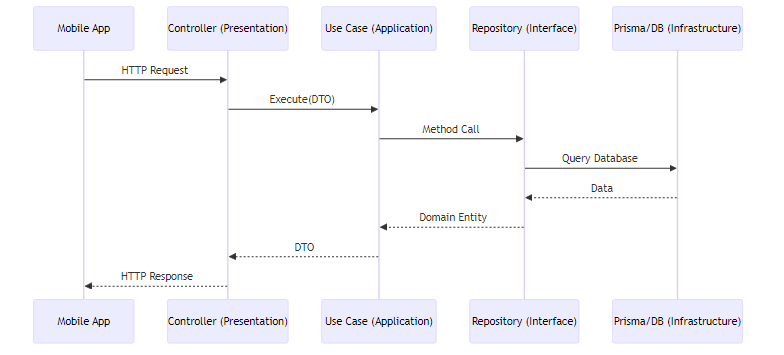

# Project Architecture

This project follows a robust architecture designed for scalability, maintainability, and clear separation of concerns.

## High-Level Overview

The system consists of a mobile application (Frontend) and a backend API server.

## Frontend Architecture

The frontend is built with **Expo (React Native)** using **Expo Router** for navigation. It follows a layered architecture to separate UI, business logic, and data access.

### Key Technologies
- **Framework**: React Native with Expo
- **Routing**: Expo Router (File-system based)
- **State Management**:
  - **Server State**: TanStack Query (React Query)
  - **Client State**: React Context (`src/shared/context`, `src/context`)
- **Styling**: NativeWind (Tailwind CSS)

### Layered Structure

### Directory Structure Explanation

Todo o código do app vive em `src/` (alias `@/*` → `./src/*`).

- **`app/`**: Telas e rotas (Expo Router, file-system based).
- **`components/ui/`**: Componentes da aplicação. Alguns são adapters que
  embrulham a lib em `shared/ui` mapeando variants/tema do app.
- **`shared/`**: Base transversal — `ui/` (lib de componentes em atomic
  design), `constants/theme.ts`, `context/`, `lib/`, `config/`, `hooks/`.
- **`entities/`**: Tipos do domínio (Event, Registration, Review).
- **`features/`**: Hooks de caso de uso / view-models de fluxos específicos.
- **`services/api/`**: Clientes HTTP por recurso.
- **`hooks/`**, **`utils/`**: Hooks e helpers globais.

> A divisão `entities` / `features` / `shared` é inspirada em Feature-Sliced
> Design, mas aplicada de forma parcial e sem enforcement. Não há linter de
> camadas — trate como organização, não como regra.

## Backend Architecture

The backend follows **Clean Architecture** principles to ensure independence of frameworks, UI, and databases.

### Key Technologies
- **Runtime**: Node.js
- **Language**: TypeScript
- **ORM**: Prisma
- **Database**: PostgreSQL (via Supabase)

### Clean Architecture Layers

### Detailed Data Flow

### Modules

- **Domain (`src/domain`)**: Core business logic, entities, and repository interfaces. NO external dependencies.
- **Application (`src/application`)**: Application-specific business rules (Use Cases). Orchestrates the flow of data.
- **Infrastructure (`src/infrastructure`)**: Frameworks and drivers. Implements interfaces defined in Domain/Application (e.g., Prisma repositories).
- **Presentation (`src/presentation`)**: Entry points (HTTP Controllers). Adapts data for the Application layer.

## Database Schema

The database is managed via **Prisma ORM**.

- **User**: Core user entity.
- **Event**: Main entity for events.
- **EventRegistration**: Manages user participation in events.
- **EventReview**: Reviews and ratings for events.
- **Notification**: User notifications.

## Deployment

- **Frontend**: EAS Build (Expo Application Services).
- **Backend**: Dockerized Node.js application.
